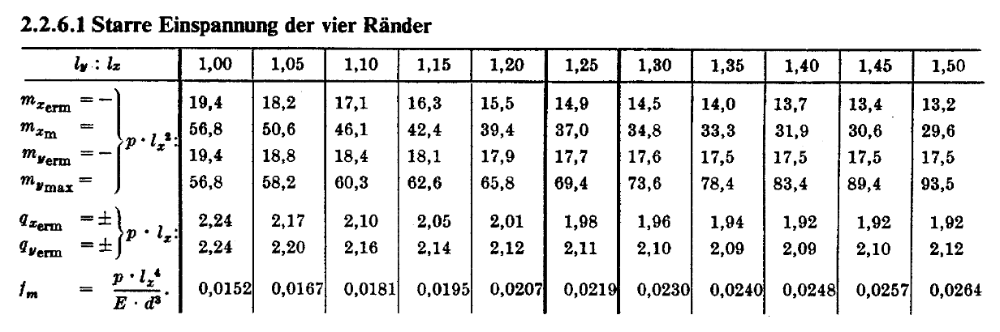

# Näherungslösung mit Finiten Elementen

```{julia}
#| output: false
include("src/setup.jl")

m, w = plate(params, 3);
NN = 4 * nnodes(m)
nb = collect(m.groups[:boundarynodes])
ni = [i for i in 1:nnodes(m) if i ∉ nb]
adofs = dofs(ni, 4)
NNa = length(adofs);
```

## Anwendungsbeispiel {.smaller}

:::: {.columns}
::: {.column width="50%"}
```{julia}
f = mkfig(a3d=false, w=800, h=800)
mplot!(m, edgesvisible=false, nodesvisible=false)
f
```
:::
::: {.column width="50%"}
[]{.down20}

- Deckenplatte $\SI{8}{m} \times \SI{8}{m}$ 

- Allseitig eingespannt gelagert

- $E=\SI{31000}{N/mm}^2$ und $\nu = 0$

- Dicke $d = \SI{20}{cm}$, 

- Belastung $q = \SI{5}{kN/m}^2$

- Kirchhoff-Plattentheorie

$\nu = 0$ für Vergleich mit Czerny-Tafeln
:::
::::


## 💡 FE: Näherungslösung {.smaller}

$\quad$

Vorgegebene Funktionen zu Näherungslösung zusammenbauen

$$
    w_h(x, y) = \sum_{i=1}^N \hat w_i \cdot \varphi_i(x, y)
$$

- $w_h$ ist die Näherungslösung (Index $h$ später)

- $\varphi_i: \Omega \to \R$ heißen Basisfunktionen

- $\Omega$ ist das Berechnungsgebiet (die Platte)

- $\hat w_i \in \R$ heißen Freiheitsgrade

- $N$ ist die Anzahl der Freiheitsgrade


```{julia}
include("src/generate-plots.jl")
```




## 💡 FE: Basisfunktionen elementweise {.smaller}

:::: {.columns}
::: {.column width="50%"}
```{julia}
f = mkfig(a3d=false,w=800, h=800)
mplot!(m, edgesvisible=true, nodesvisible=true)
f
```
:::
::: {.column width="50%"}
[]{.down20}

- Gebiet wird in Elemente zerlegt

- In der Ebene: Drei- oder Vierecke

- Elemente an Knoten miteinander verbunden

- Anzahl der Elemente frei wählbar
:::
::::


## 💡 FE: Basisfunktionen elementweise {.smaller}

:::: {.columns}
::: {.column width="50%"}
**Funktionen für ein Element**
```{julia}
plot3d!()
fplot3d(H4, fig=Figure(size=(1300, 1100)))
```
:::
::: {.column width="50%"}
**Kombination von Elementfunktionen**
```{julia}
plotw(
    m, 
    ei(NN, adofs[5]), 
    w=1200, h=550,
    edgesvisible=true,
    limits=(nothing,nothing,(-1,1))
)
```
[]{.up40}
```{julia}
plotw(
    m,
    ei(NN, adofs[12]), zs=4,
    w=1200, h=550,
    edgesvisible=true,
    limits=(nothing, nothing, (-1, 1))
)
```
:::
::::

[]{.up20}

$\rightarrow$ Wichtig bei Kirchhoff-Platte: Kein Knick an Elementkanten!


## 💡 FE: Optimale Koeffizienten $\hat w_i$ {.smaller}

Bestimmung aus linearem Gleichungssystem

$$
    \mathbf{K}\hat{\mathbf{w}} = \mathbf{r}
$$

- Herleitung: Koeffizienten so wählen, dass Fehler im 'gewichteten Mittel' minimal wird

- Näherungslösung: Differentialgleichung wird nicht in jedem Punkt erfüllt

- Diskretisierungsfehler: Unterschied zwischen Näherung $w_h$ und exakter Lösung $w$

- Auflagerbedingungen und Lasten im LGS berücksichtigen

- Matrix $\mathbf{K}$ wird wieder aus Elementmatrizen assembliert

- Elementmatrizen nicht unmittelbar physikalisch interpretierbar

- Kinematisches System wie für Stabtragwerke

$\rightarrow$ Mathematische Theorie umfangreich und schwierig!


```{julia}
function plotsol(n)
m, wHat = plate(params, n);
plotw(
    m, wHat, 
    w=1200, h=650,
    zs=2400*maximum(wHat), # plotw scales by 1 / maximum(wHat)
    edgesvisible=true, edgelinewidth=4,
    limits=(nothing,nothing,(0,1.15))
)
end;
```


## Beispiel: Lösung mit 4 Elementen
```{julia}
plotsol(2)
```


## Beispiel: Lösung mit 9 Elementen
```{julia}
plotsol(3)
```


## Beispiel: Lösung mit 16 Elementen
```{julia}
plotsol(4)
```


## Beispiel: Lösung mit 100 Elementen
```{julia}
plotsol(10)
```


## Konvergenz

```{julia}
CairoMakie.activate!()
l = 8
nn = [];
ww = [];
for n = 4:2:30
    mn, wn = plate(params, n)
    push!(nn, 4 * nnodes(mn))
    push!(ww, maximum(abs.(wn[1:4:end])))
end
w_fe = ww[end];
```

:::: {.columns}
::: {.column width="50%"}
```{julia}
fig = Figure()
Axis(fig[1, 1], xlabel="Anzahl Freiheitsgrade", ylabel="Maximale Verschiebung in mm")
scatterlines!(nn, 1000*ww)
fig
```
:::
::: {.column width="50%"}
- Verschiebung nähert sich exakter Lösung an
- Wenige Elemente: Verschiebung zu groß
- Wichtiger: Schnittgrößen - später
:::
::::


## Vergleich mit Czerny-Tafel {.smaller}



```{julia}
#| echo: true
w_czerny = 5e3 * 8^4 / (31000e6 * 0.2^3) * 0.0152
100 * abs(w_fe - w_czerny) / w_czerny
```

$\rightarrow$ Hervorragende Übereinstimmung mit 0.05 Prozent Unterschied
