# Grundlagen

## 

[]{.down200}

::: {.r-fit-text}
[Lesen Sie im Handbuch!](https://www.dlubal.com/de/downloads-und-infos/dokumente/online-handbuecher/rfem-6)
:::

## Arbeitsweise von RFEM 1/2

::: {.columns}
::: {.column width="40%"}
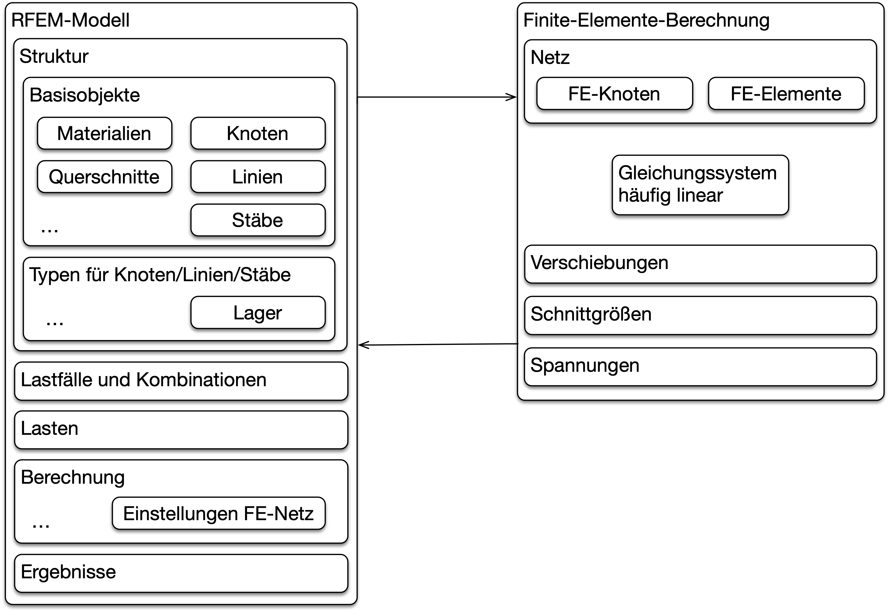
:::
::: {.column width="60%"}
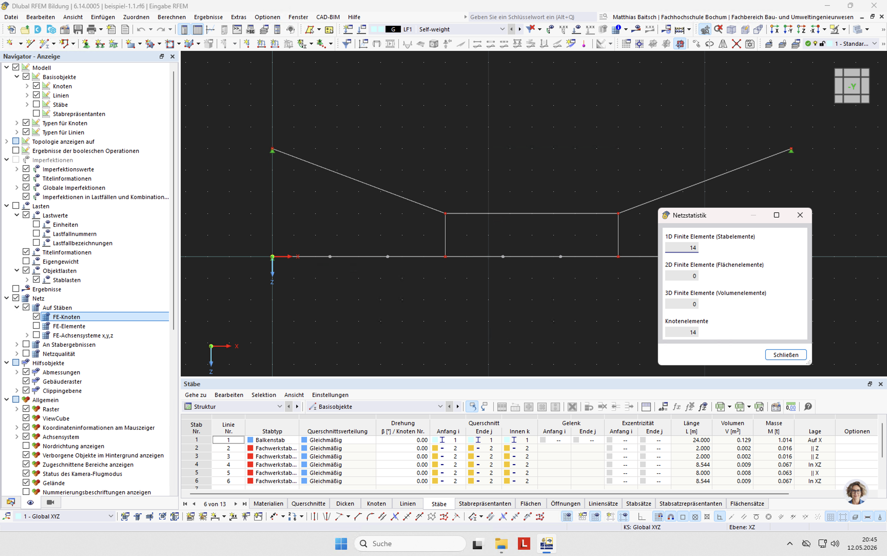
:::
:::

- Objekte in RFEM werden in Berechnungsmodell übertragen
- Netzgenerierung: FE-Knoten und FE-Elemente erzeugen

## Beispiel Stabunterteilung für Ergebnisse 1/3

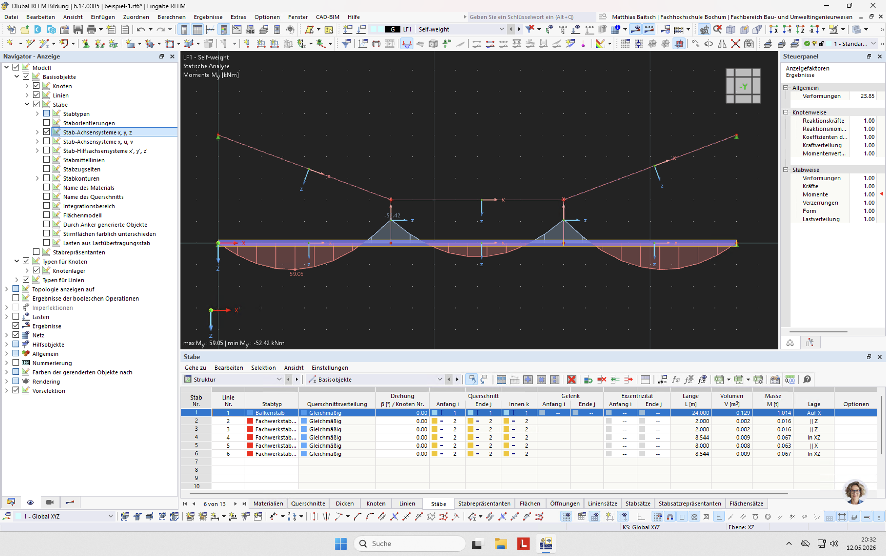

- Standardeinstellung

## Beispiel Stabunterteilung für Ergebnisse 2/3

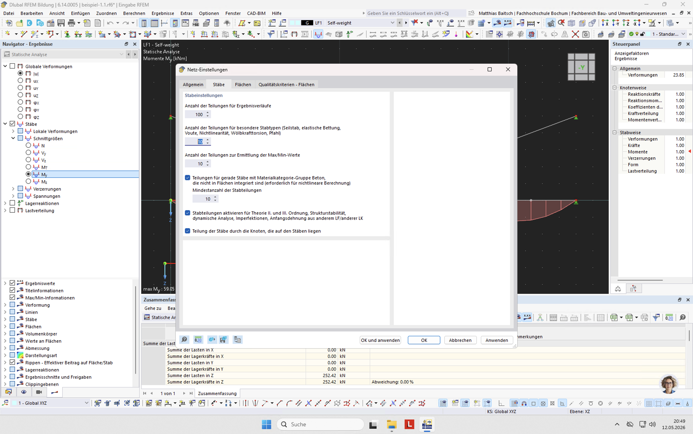

- Unterteilung erhöhen (Voreinstellung ist 10)

## Beispiel Stabunterteilung für Ergebnisse 3/3

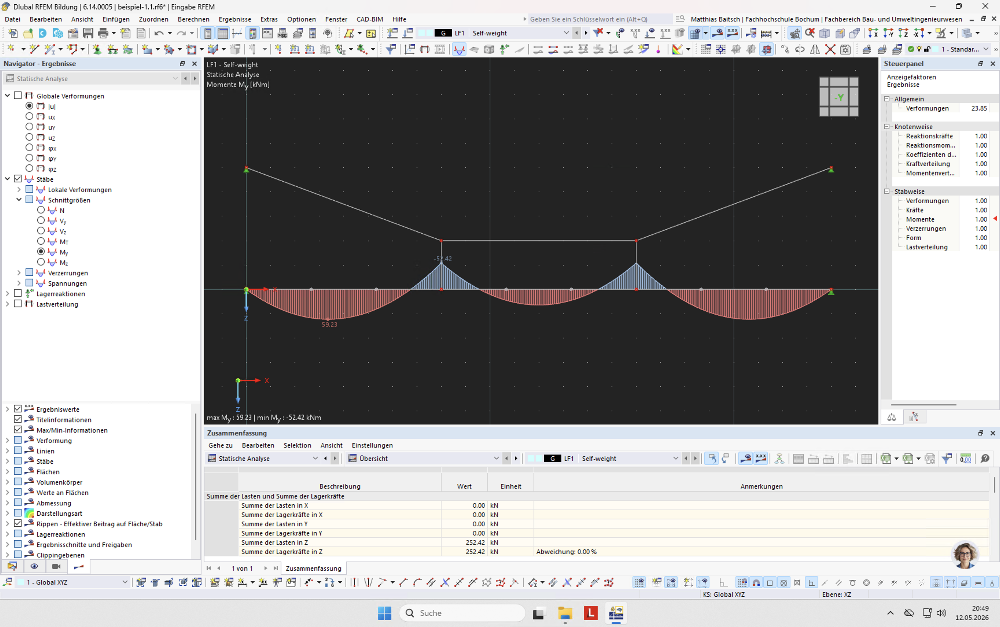

- Maximum Biegemoment etwas genauer

## Für uns relevante Terminologie

- Basisobjekte: Elementare Struktureigenschaften
    - Knoten: Punkt mit Eigenschaften
    - Linie: Verbindet Knoten (Strecke, Polylinie, Bogen, etc.)
    - Stab: Linie mit Querschnitt und weiteren Eigenschaften
    - Stabrepräsentanten: Gruppen von Stäben mit identischen Eigenschaften
- Typen für Knoten/Linien/Stäbe: Eigenschaften
    - Lagerbedingungen
- Lasten: Belastung in Lastfällen
    - Knoten/Linien/Stäbe/Flächen

## Benutzungsoberfläche

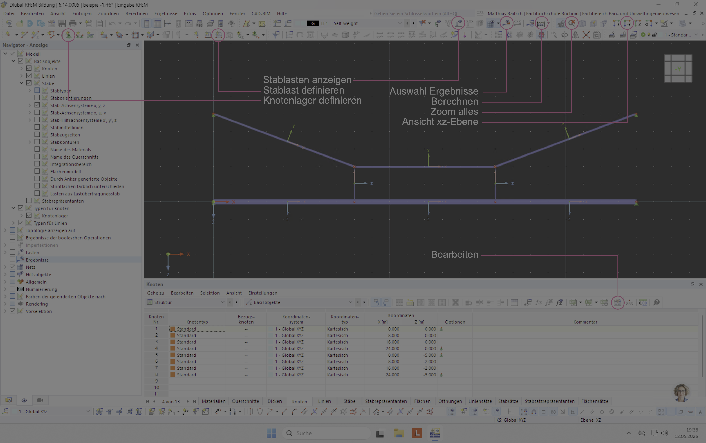

# Eingabe von Stabtragwerken

## Vorgehensweise

- Einfache Systeme (eben, wenige Stäbe)
    - Mit der Maus
- Moderat komplexe Systeme (räumlich, wenige Stäbe)
    - Mit Knoten, Linien und Stäben
    - Eingabe im Tabellenbereich oft effizienter
    - Wichtig ist gute Skizze
- Komplexe Systeme (räumlich, > 50 Stäbe)
    - Tabellen in Excel erzeugen
    - Skripte programmieren (Javascript)

## Knoten

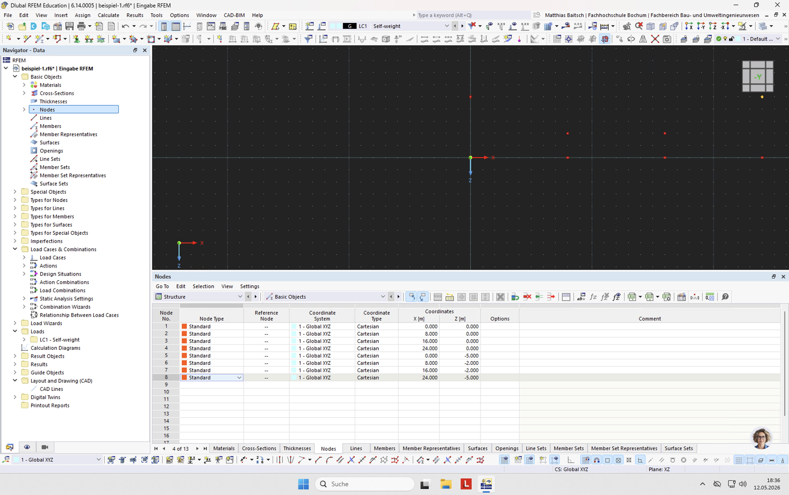

- Eingabe in Tabellenbereich mit Tastatur
- Alternativ: Koordinaten aus Excel-Tabelle kopieren

## Linien

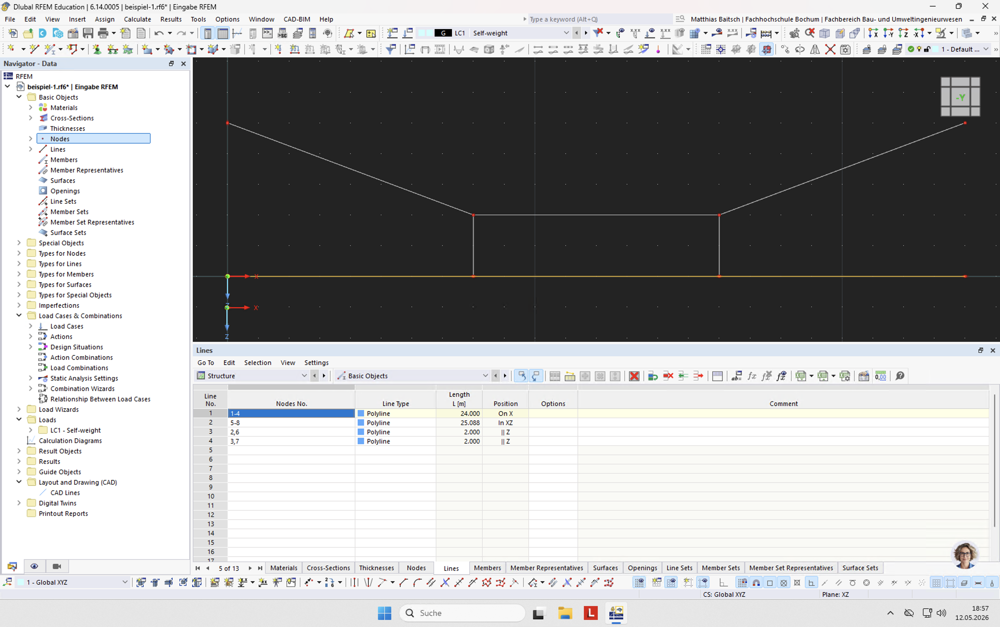

- Linien verbinden zwei oder mehr Knoten
- Eingabe mit `n1, n2, n3` (allgemein) bzw. `n1 - n2` (fortlaufend nummeriert)

## Stäbe

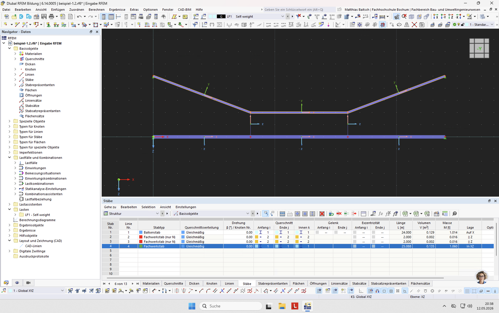

- Liniennummer eingeben
- Querschnitt anpassen

## Stäbe auf gekrümmten Linien

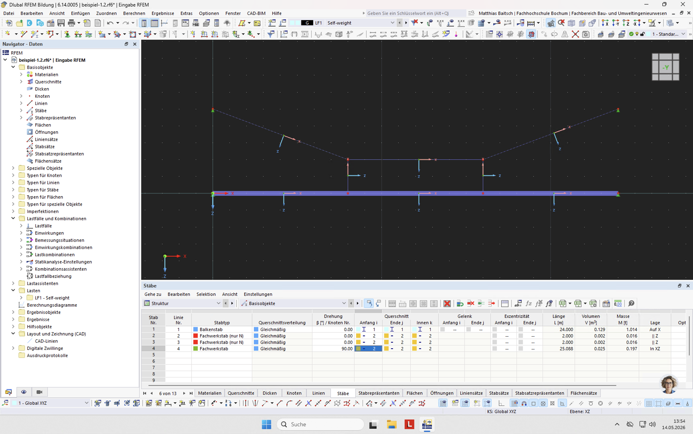

- Gegebenenfalls Stabachse um 90° drehen
- Nicht für 'Fachwerkstab (nur N)'

## Auflager

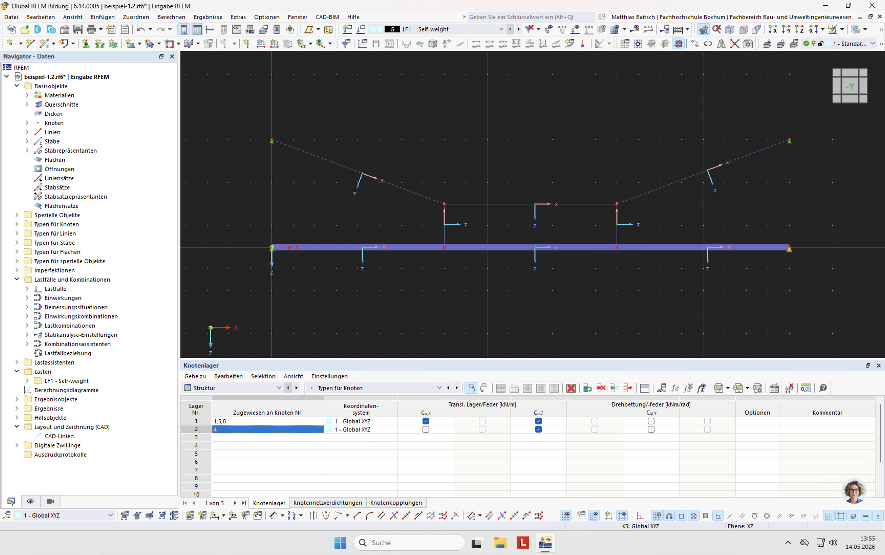

- Typen für Knoten auswählen
- Gegebenenfalls Federsteifigkeiten definieren

## Stablasten

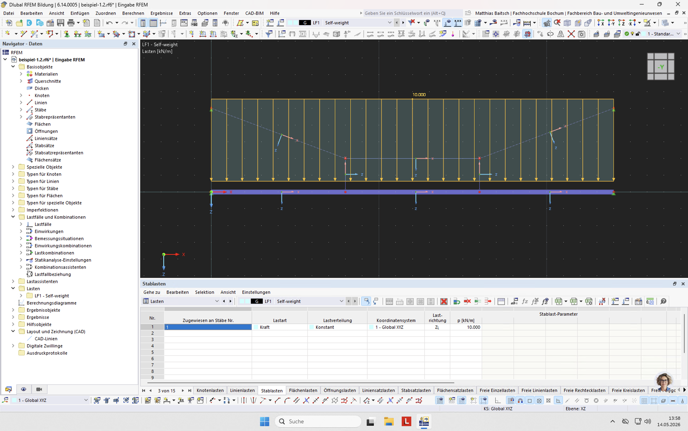

- Lasten und Lastfall auswählen
- Einstellungen ggf. mit Dialog

# Systeme mit Excel eingeben

## Installation

- Anleitung [hier](https://www.dlubal.com/de/support-und-schulungen/support/faq/005188)

