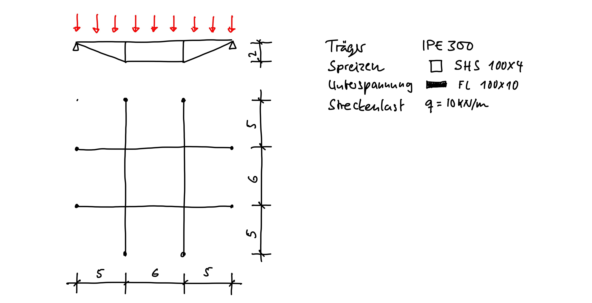
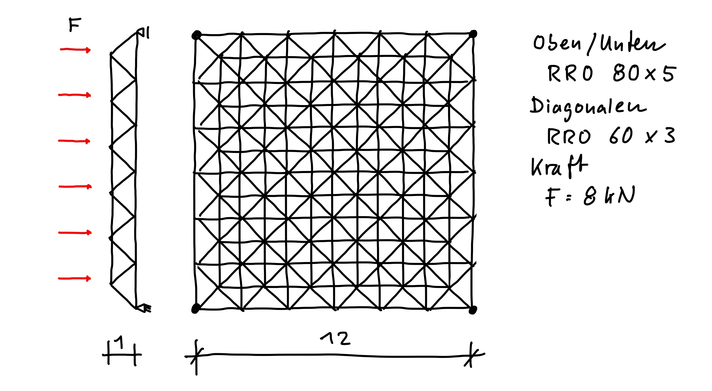

## Beispiel zur Einführung

Für den dargestellten räumlich unterspannten Trägerrost sollen die Schnittgrößen berechnet und dargestellt werden. Eigengewicht ist zu berücksichtigen.

Schritte:

1. Fertigen Sie eine bemaßte Skizze an, in der Knoten und Linien nummeriert sind. In der Aufgabenstellung sind die Auflager nicht vollständig definiert. Treffen Sie sinnvolle Annahmen und tragen Sie diese in der Skizze ein
1. Geben Sie Material und Querschnitte ein
1. Erstellen Sie Knoten, Linien und Stäbe (tabellarische Eingabe)
1. Definieren Sie die Lagerung
1. Definieren Sie die Lasten
1. Führen Sie die Berechnung durch und korrigieren Sie ggf. Eingabefehler
1. Ermitteln Sie überschlägig das Eigengegewicht der Konstruktion (schräge Stäbe gerade sein lassen) und die Resultierende der Last und kontrollieren Sie damit die Auflagerreaktionen
1. Plotten Sie die Schnittgrößenverläufe

## Fachwerkstab in RFEM

In RFEM gibt es einen 'Fachwerkstab' und einen 'Fachwerkstab (nur N)'. Aufgaben:

1. Was sagt hierzu die RFEM Dokumentation?
1. Erklären Sie anhand eines einfachen Berechnungsbeispiels den Unterschied

## Eingabe mit Excel

Geben Sie den räumlich unterspannten Trägerrost aus dem ersten Aufgabenteil mithilfe von Excel ein

1. Laden Sie das [Grundgrüst](daten/trägerrost-excel.rf6) herunter
1. Gehen Sie die Schritte in den Folien zu RFEM durch
1. Vergessen Sie nicht, die Excel-Datei zu sichern

## Mero-Halle im Berliner Spreepark

Das MERO-System (nach dem Erfinder **Me**ngeringhausen und dem **Ro**hrbauweise-Prinzip) ist ein modulares Raumfachwerk aus Stahlrohren und Kugelknoten. Die vorgefertigten Elemente lassen sich zu weit gespannten, leichten Dachkonstruktionen zusammensetzen.

Im Berliner Spreepark, dem ehemaligen DDR-Freizeitpark Kulturpark Plänterwald, befindet sich eine solche MERO-Halle, die insgesamt rund 1800m² überspannt. Für die Veranstaltungsreihe *Blaue Stunde* wurde die Halle saniert und umgebaut.

::: {layout-ncol=2 #fig-spreepark}

[Mero-Halle](https://www.baunetzwissen.de/sonnenschutz/objekte/sonderbauten/hallenumbau-blaue-stunde-im-berliner-spreepark-8554480) im Berliner Spreepark (Quelle: www.baunetzwissen.de)
:::

Aufgaben:

1. Installieren Sie das Dlubal-Plugin in Excel ([Anleitung](https://www.dlubal.com/de/support-und-schulungen/support/faq/005188))
1. Geben Sie das System in RFEM ein und berechnen Sie die Schnittgrößen

