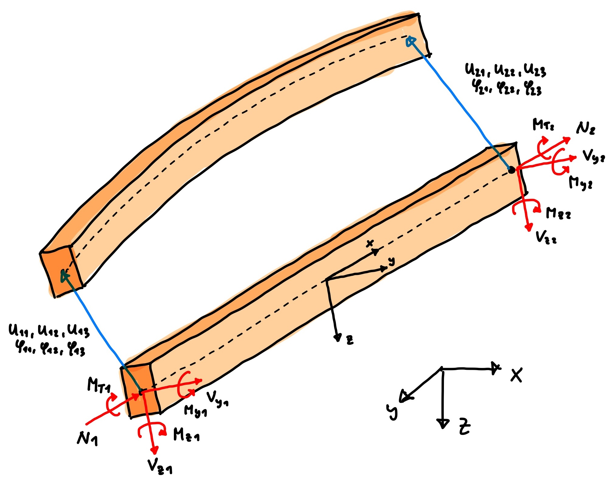
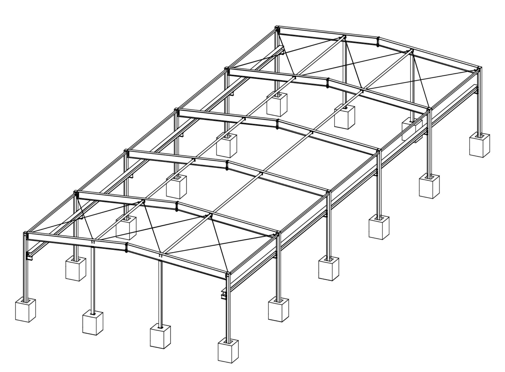
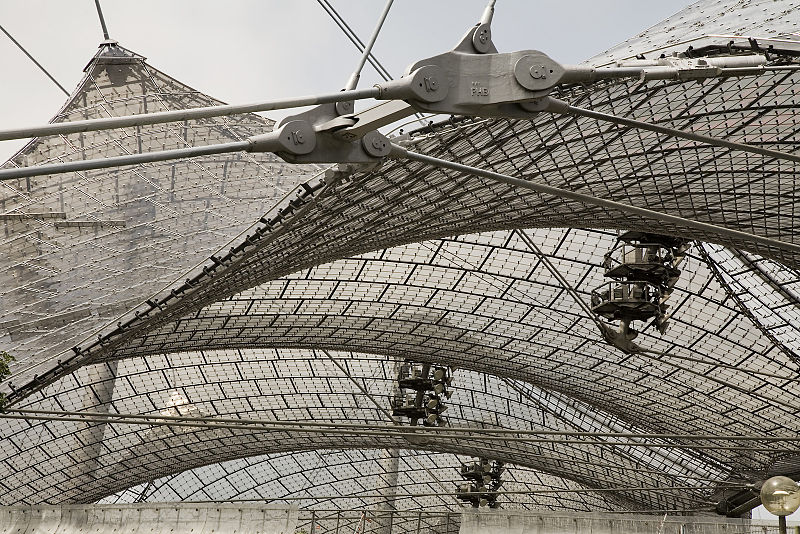

# Beispiele

## {background-image="00-pics/isozaki-palafolls.jpg"}

::: {.bildunterschrift}
Sportkomplex Palafolls (Spanien), Arata Isozaki, 1996
:::

## {background-image="00-pics/tuerme.png"}

::: {.bildunterschrift}
Türme von Gustave Eiffel und Vladimir Shukhov
:::

## {background-image="00-pics/Bild01_ausschnitt_MAX.jpg"}

::: {.bildunterschrift}
Dach DG Bank Berlin, Frank O. Gehry/SBP, 
:::

## {background-image="00-pics/neue_nationalgalerie_neu.jpg"}

::: {.bildunterschrift}
Neue Nationalgalerie Berlin, Ludwig Mies van der Rohe, 1968 
:::

# Berechnung

## Räumliches Balkenelement

::: {.columns}
::: {.column width="47%"}
[]{.down80}

:::
::: {.column width="53%"}
- Sechs Freiheitsgrade je Knoten
  - drei Verschiebungen
  - drei Verdrehungen
- Sechs Stabendkräfte je Knoten
  - Normalkraft, Querkräfte
  - Torsionsmoment, Biegemomente
- Ausrichtung des Querschnitts?
  - Lokale y-Achse parallel zur xy-Ebene
  - Einstellung im Programm
:::
:::

## Ablauf Berechnung {.smaller}

- Auflagerbedingung für jeden Freiheitsgrad
  - Insgesamt $2^6 = 64$ verschiedene Möglichkeiten
- Streckenlasten in Bezug aus lokales oder globales Koordinatensystem
- Berechnung läuft genauso ab wie in 2D
  - Elementsteifigkeitsmatrizen zu globaler Matrix
  - Lasten in globalen Lastvektor
  - Lineares Gleichungssystem

## Unterschied zu 2D  {.smaller}

::: {.columns}
::: {.column width="2%"}
:::
::: {.column width="45%"}

:::
::: {.column width="8%"}
:::
::: {.column width="45%"}

:::
:::

- Mehr Rechenaufwand für Computer (kein Problem bis ca. 10000 Knoten)
- Viel wichtiger
  - Deutlich mehr Möglichkeiten für Fehler bei Eingabe
  - Ergebnisse umfangreicher und schwieriger zu interpretieren
  - Plots schlechter lesbar

$\rightarrow$ Nur wenn wirklich notwendig!

